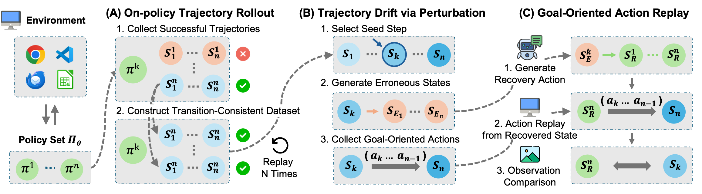

# 🧭 Lost in Recovery: Demystifying Recovery Behavior of Computer-Use Agents via Goal-Oriented Action Replay
[]()

> *A Scalable Framework for Systematic analysis of recovery behavior in computer-use agents via goal-oriented action replay*
---
## 📘 Overview

**ReTRACE** systematically analyzes the recovery behavior of computer-use agents by introducing Transition-Consistent Recovery and goal-oriented action replay, enabling reliable characterization of agents' ability to restore previous states after failures.

<p align="center">
  
</p>

---

## 🚀 Setup & Usage

> 🚧 Code will be released soon.

### 📜 Citation
If you find our research useful, please cite our paper.

```bibtex
